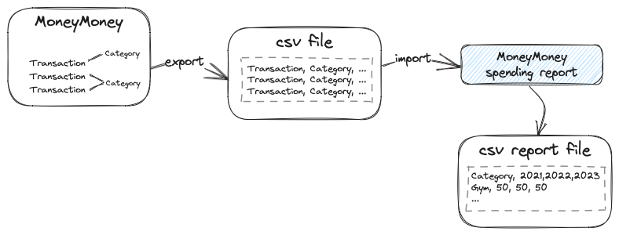

# MoneyMoney spending report

## What is it?
I track and categorize my spendings with [MoneyMoney](https://moneymoney-app.com/). 
This app allows me to get a report of my average spendings per month by category and year.

## Why?
I wanted to know how much I spend on average on certain categories per month. I could not find a way to do this in MoneyMoney, so I wrote this little app.

## How to use it?
1. Export your transactions from MoneyMoney to a CSV file (see [MoneyMoney documentation](https://moneymoney-app.com/api/export/)).
2. Your csv file should contain the columns: `Datum, Betrag, Verwendungszweck, Kategorie`
2. Run the app and enter the path to the CSV file.
3. The app will generate a report in the same folder as the CSV file.
4. Open the report in Excel or Numbers and enjoy.
